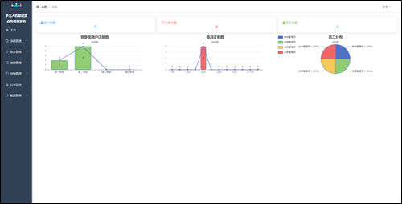
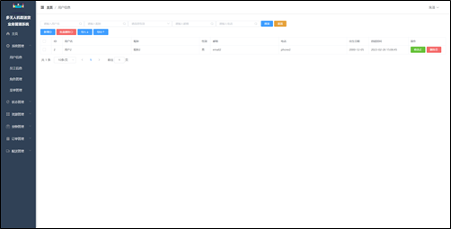
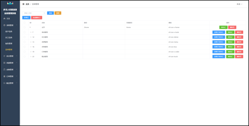
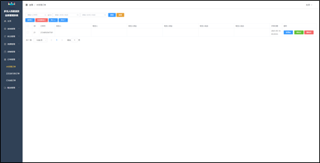
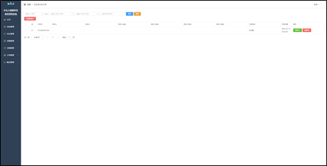
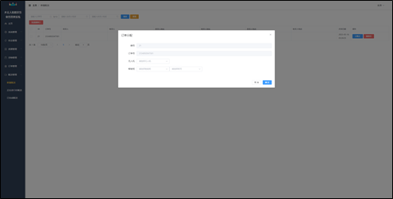
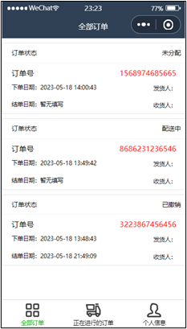

# 毕设项目--多无人机取送货业务管理系统
## 简介
此项目为SpringBoot+Vue+MyBatis-Plus和微信小程序+SpringBoot实现的前后端分离项目。
## 网页端部分截图如下

## 微信小程序端部分截图如下

## 代码介绍
* springboot文件夹为springboot+vue代码
* weixin文件夹为微信小程序代码（不完整，部分功能未实现）
